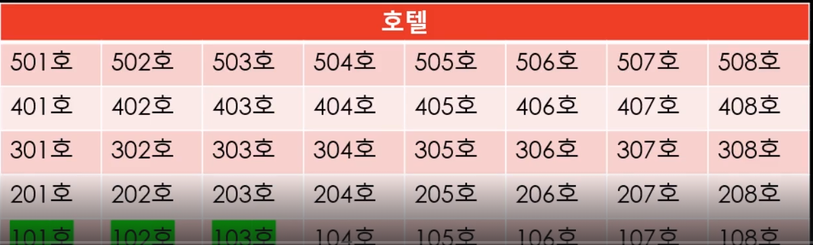
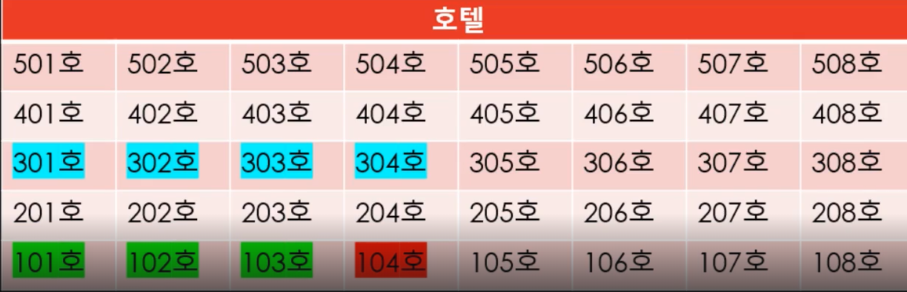
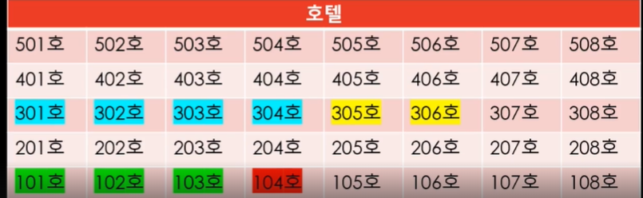
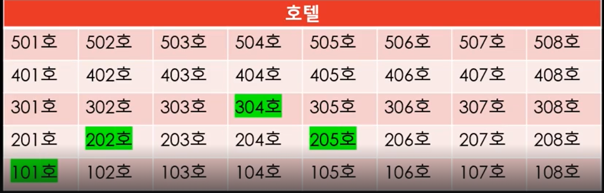

# 배열vs동적배열vs연결리스트

## 배열
- 사용할 방 개수를 고정해서 계약하고(변경불가), 연속된 방으로 배정받아서 사용
- 장점 : 연속된 방
- 단점 : 방을 추가 / 축소 불가

## 동적 배열
- 사용할 방 개수를 유동적으로 계약, 연속된 방으로 배정받아 사용
- 문제점 : 이사비용

- 동적배열 할당정책
- 실제로 사용할 방보다 많이, 여유분을 두고 (대략 1.5 ~ 2배) 예약, 이사횟수를 초기화

- 장점 : 유동적인계약(방 추가 예약으로 이사횟수 초기화, 배열 요소 접근 시 연결리스트보다 성능이 우수함)
- 단점 : 중간 삽입/ 삭제

## 연결 리스트
- 연속되지 않는 방을 사용
- 장점 : 중간 추가 / 삭제 이점
- 단점 : 임의의 방을 바로 찾을 수 가 없다 (임의 접근 RandomAccess 불가능)

